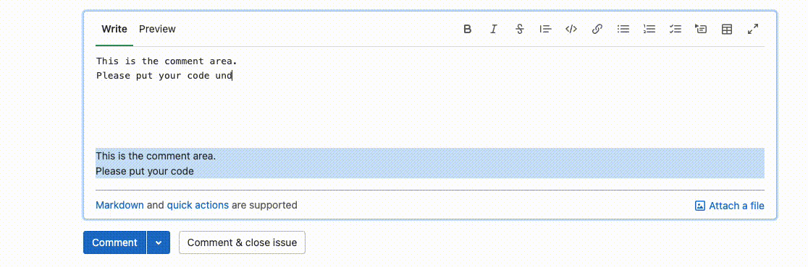

# Gitlab Realtime Markdown Preview
A Chrome/Edge extension for displaying realtime preview of markdown when leaving comments.

## Setup
Please follow [these steps](https://developer.chrome.com/docs/extensions/mv3/getstarted/#unpacked) to add the extension to your Chrome/Edge browser.

1. Open the `Extension Management` page by navigating to `chrome://extensions`.
    - Alternatively, open this page by clicking on the `Extensions` menu button and selecting `Manage Extensions` at the bottom of the menu.
    - Alternatively, open this page by clicking on the `Chrome` menu, hovering over `More Tools` then selecting `Extensions`
2. Enable `Developer Mode` by clicking the toggle switch next to Developer mode.
3. Click the `Load unpacked` button and select the extension directory.
